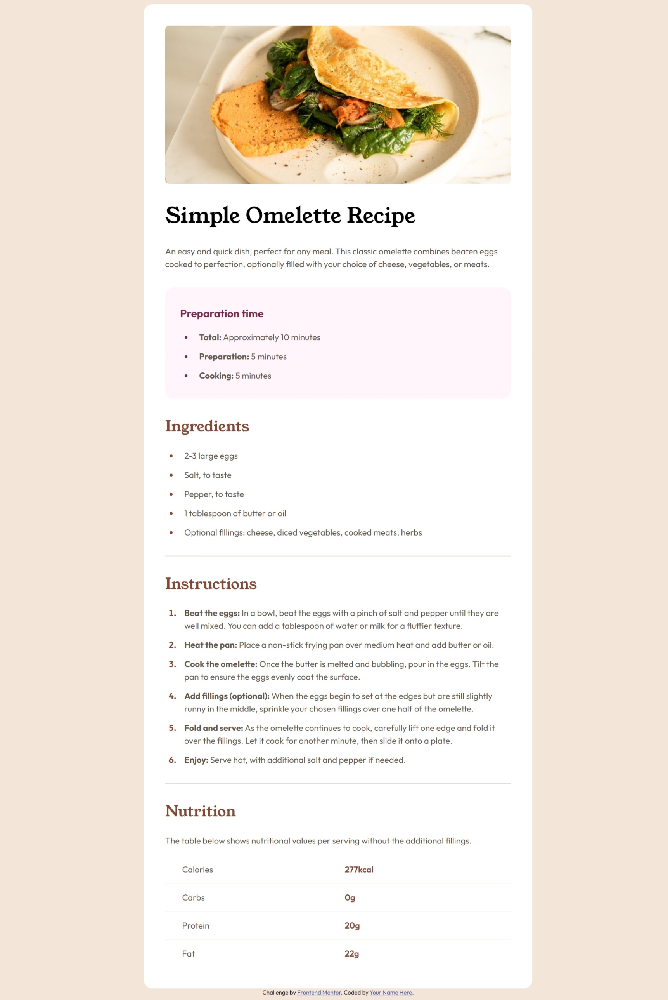

# Frontend Mentor - Recipe page solution

This is a solution to the [Recipe page challenge on Frontend Mentor](https://www.frontendmentor.io/challenges/recipe-page-KiTsR8QQKm). Frontend Mentor challenges help you improve your coding skills by building realistic projects. 

## Table of contents

- [Overview](#overview)
  - [The challenge](#the-challenge)
  - [Screenshot](#screenshot)
  - [Links](#links)
- [My process](#my-process)
  - [Built with](#built-with)
  - [What I learned](#what-i-learned)

**Note: Delete this note and update the table of contents based on what sections you keep.**

## Overview

### Screenshot



### Links

- Solution URL: [Add solution URL here](https://your-solution-url.com)
- Live Site URL: [https://junwei-wong.github.io/recipe-page-main/](https://junwei-wong.github.io/recipe-page-main/)

## My process

### Built with

- Semantic HTML5 markup
- CSS custom properties
- Flexbox
- Mobile-first workflow

### What I learned

Changing hr into a single shade, you will need to add border-style:solid.
```css
 hr {
    border-color: var(--stone-150);
    border-style: solid;
  }
```

Targeting the li marker specifically to change it's color
```css
  ul ::marker {
    /* works */
  }

  li::marker{
    /* works */
  }
```

Adding border to the each rows
```css
  tr:not(:last-child) td {
    border-bottom: 1px solid var(--stone-150);
  }
```